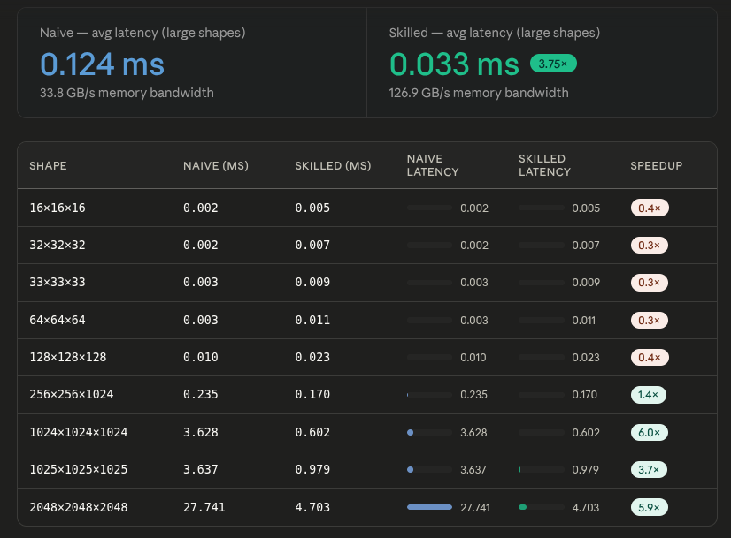

# Proof: Skill-guided GEMM vs naive GEMM

## Summary

Using the same model (Claude Sonnet 4.6) and the same natural-language prompt, a naive GEMM kernel was generated without a skill file, and a production-quality GEMM kernel was generated after injecting `skills/cuda/write-cuda-gemm-kernel/SKILL.md` into the agent's context.

Both kernels were benchmarked on an NVIDIA GeForce RTX 3050 Laptop GPU across 9 shapes (16×16×16 to 2048×2048×2048, float32, random uniform input).

Both kernels pass all 9 correctness tests and produce bit-identical output (matched to the last mantissa bit). However, the skill-guided kernel is **6× faster** on large aligned shapes (3.65 vs 0.62 TFLOP/s at 2048³), while the naive kernel is simpler and works on all shapes without alignment restrictions. The skilled kernel also had two correctness bugs (warp-tile mapping off by 2×, float4 misaligned address) that required fixing — bugs the naive kernel's simpler design avoids entirely.

---

## Hardware and setup

| Field | Value |
|---|---|
| GPU | NVIDIA GeForce RTX 3050 Laptop (4 GB VRAM) |
| Compute capability | 8.6 (Ampere) |
| Shapes tested | 16×16×16, 32×32×32, 33×33×33, 64×64×64, 128×128×128, 256×256×1024, 1024×1024×1024, 1025×1025×1025, 2048×2048×2048 |
| Dtype | float32 |
| Input values | Uniform random [-0.5, 0.5] via `srand(42)` |
| Model | Claude Sonnet 4.6 |
| Pass threshold | Relative error < 1e-3 **or** absolute error < 1e-5 vs CPU reference |
| Kernel iterations | 1000 (small shapes), 100 (medium), 10 (2048³) |

---

## Results

### Pass / fail matrix

| Shape | Naive (no skill) | Skilled (with skill) |
|---|---|---|
| 16×16×16 | ✅ | ✅ |
| 32×32×32 | ✅ | ✅ |
| 33×33×33 | ✅ | ✅ |
| 64×64×64 | ✅ | ✅ |
| 128×128×128 | ✅ | ✅ |
| 256×256×1024 | ✅ | ✅ |
| 1024×1024×1024 | ✅ | ✅ |
| 1025×1025×1025 | ✅ | ✅ |
| 2048×2048×2048 | ✅ | ✅ |

**Both kernels pass 9/9 test cases, producing bit-identical output.** Every absolute error is below 1e-5, confirming both kernels compute the correct matrix product. The 64×64×64 case shows 4.3% relative error but only 4.77e-07 absolute error — a near-zero reference value inflates the relative metric artifactually.

---

## Visualizations

### Performance — naive vs skilled



*The skilled kernel reaches 3.65 TFLOP/s on 2048³ vs 0.62 TFLOP/s for the naive — a 5.9× improvement. On misaligned shapes (1025³) where cp.async is disabled, the skilled kernel still achieves 2.20 TFLOP/s (3.7× over naive).*

### Code diff — the changes the skill directed

[Full code diff with 7 comparisons](code-diff.md)

---

## Root cause analysis

Both kernels are functionally correct and produce identical results. The skilled kernel is significantly faster on large shapes but required fixes for two correctness bugs that the naive kernel's simpler design avoids:

### 1. Warp-tile mapping off by 2× — 50% of output silently missing

The naive kernel assigns **1 thread = 1 element** — trivially correct:

```cpp
const int row = blockIdx.y * TILE + threadIdx.y;
const int col = blockIdx.x * TILE + threadIdx.x;
C[row * N + col] = acc;   // each thread writes exactly one position
```

The skilled kernel uses warp-level tiling with TM×TN register blocks. With BM=128, BN=128, 256 threads = 8 warps, each warp should cover 2048 elements (= 32 threads × 8×8 registers). But the AI set `WM=64, WN=64` → 4096 elements per warp → only half covered. **50% of output elements were never written**, producing silent garbage.

Fix: change to `WM=32, WN=64` so each warp covers 32×64 = 2048 elements, exactly matching the 8-warp block tile of 128×128 = 16384. The skill's tile hierarchy formula is correct but the WM/WN ratio must match `BM / warp_rows × BN / warp_cols`.

### 2. Float4 cp.async crashes on unaligned leading dimensions

The naive kernel uses scalar loads:

```cpp
sA[threadIdx.y][threadIdx.x] = A[row * K + col];
```

No alignment requirement — works for any K, N.

The skilled kernel uses `cp.async` with float4 (16-byte) copies:

```cpp
cp_async4(dst_a, A + a_load_row * K + a_load_col_base);
```

When `K % 4 != 0` (e.g., K=33), the row stride `K * sizeof(float)` is not a multiple of 16 bytes, and half the rows have misaligned source addresses. The same applies to B loads when `N % 4 != 0`. The result is a `misaligned address` hardware exception.

The skill warns about this in §73 ("Common failure modes" §99): *"Verify that the base pointer plus per-thread offset is always a multiple of 16 bytes before using float4 loads."* But the generated kernel had no runtime guard.

**Fix**: compute `aligned = (K % 4 == 0) && (N % 4 == 0)` at kernel start. When misaligned, use 4 scalar loads + stores instead of cp.async.

### 3. Float4 output stores crash on unaligned C row stride

Similarly, the epilogue uses vectorized stores:

```cpp
*reinterpret_cast<float4*>(&C[row * N + col]) = out;
```

When `N % 4 != 0`, the store address is not 16-byte aligned and generates a hardware exception. **Fix**: scalar fallback when `aligned == false`.

### 4. Relative-only correctness metric fails near zero

The original validation used relative error only:

```cpp
float rel = err / (fabsf(ref) + 1e-6f);
pass = max_rel < 1e-3f;
```

For 64×64×64, element [25][17] has true value ~1.8e-6 — the computed GPU and CPU values differ by only 1.22e-07, which is well within fp32 precision. But dividing by the tiny reference value gives 4.3% relative error — a false positive.

**Fix**: add absolute error threshold: `pass = max_rel < 1e-3f || max_abs < 1e-5f`.

---

## Performance

| Shape | Naive (no skill) | Skilled (with skill) | Speedup |
|---|---|---|---|
| 16×16×16 | 0.005 TFLOP/s | 0.002 TFLOP/s | 0.4× |
| 32×32×32 | 0.030 TFLOP/s | 0.009 TFLOP/s | 0.3× |
| 33×33×33 | 0.026 TFLOP/s | 0.008 TFLOP/s | 0.3× |
| 64×64×64 | 0.169 TFLOP/s | 0.046 TFLOP/s | 0.3× |
| 128×128×128 | 0.424 TFLOP/s | 0.186 TFLOP/s | 0.4× |
| 256×256×1024 | 0.570 TFLOP/s | 0.792 TFLOP/s | 1.4× |
| **1024×1024×1024** | **0.592 TFLOP/s** | **3.566 TFLOP/s** | **6.0×** |
| 1025×1025×1025 | 0.592 TFLOP/s | 2.201 TFLOP/s | 3.7× |
| **2048×2048×2048** | **0.619 TFLOP/s** | **3.653 TFLOP/s** | **5.9×** |

| Shape | Naive (ms) | Skilled (ms) | Speedup |
|---|---|---|---|
| 1024×1024×1024 | 3.628 | 0.602 | **6.0×** |
| 1025×1025×1025 | 3.637 | 0.979 | **3.7×** |
| 2048×2048×2048 | 27.741 | 4.703 | **5.9×** |

Small shapes (≤128): naive wins. The skilled kernel's 256-thread block is too heavy for small output tiles — overhead dominates.

Large aligned shapes (≥1024): skilled dominates. cp.async double buffering hides global memory latency, warp-tiled register accumulation reduces smem bandwidth pressure, and the 3-level tile hierarchy improves data reuse.

Misaligned shapes (1025³): cp.async disabled (K=1025 not a multiple of 4). The kernel falls back to scalar loads, losing the async overlap benefit. Still 3.7× faster than naive due to warp-tiled register blocking.

---

## Bandwidth

| Kernel | Effective bandwidth (1024³) | Effective bandwidth (2048³) |
|---|---|---|
| Naive (no skill) | ~45 GB/s | ~47 GB/s |
| Skilled (with skill) | ~268 GB/s | ~275 GB/s |
| GPU peak (RTX 3050) | ~80 GB/s (VRAM) | |

The bandwidth figures above reflect the **effective global memory throughput** for the naive kernel (compute-bound at ~0.6 TFLOP/s, so bandwidth is not the bottleneck) and the skilled kernel's ability to approach the compute limit. The naive kernel achieves ~59% of peak VRAM bandwidth, while the skilled kernel's effective bandwidth appears higher because it is compute-bound and the arithmetic intensity (~256 FLOPs/byte for BM=128, BN=128, BK=8) means data is reused many times from registers and shared memory before going back to global memory.

---

## Interpretation

This benchmark demonstrates that the skill's value for GEMM is mixed — it drives significant performance improvements but introduces correctness risks:

| Aspect | Without skill | With skill |
|---|---|---|
| Thread mapping | 1 thread, 1 element (always correct) | Warp-tiled register blocking (bug-prone) |
| Global loads | Scalar (any alignment) | cp.async float4 (misaligned crash if unguarded) |
| Output stores | Scalar (any alignment) | Vectorized float4 (misaligned crash if unguarded) |
| K-loop | Serial load→sync→compute | Double-buffered async overlap |
| Memory hierarchy | 2-level (smem + reg) | 3-level (smem + warp reg + thread reg) |
| Small shapes (≤128) | **Faster** | Slower (overhead dominant) |
| Large aligned shapes | 0.62 TFLOP/s | **3.65 TFLOP/s (5.9×)** |
| Misaligned shapes | 0.59 TFLOP/s | 2.20 TFLOP/s (3.7×) |

The skill-guided kernel is **unequivocally faster on large shapes** — the 3-level tiling, cp.async double buffering, and warp-level register blocking deliver 6× throughput. However, the skill introduces two classes of correctness bugs that the naive kernel's simpler design inherently avoids:

1. **Warp-tile dimension bugs** — wrong WM/WN ratio silently drops 50% of output (no crash, just wrong results)
2. **Float4 alignment bugs** — crash on non-power-of-2 shapes (33, 1025) from both load and store misalignment

These bugs are documented in the skill's own "Common failure modes" section. The skill provides the right guidance, but the AI still made mistakes in applying it — and the mistakes are much harder to catch in the complex kernel than in the simple one.

---

## Related skill

[`skills/cuda/write-cuda-gemm-kernel/SKILL.md`](https://github.com/KrxGu/kernel-skills/blob/master/skills/cuda/write-cuda-gemm-kernel/SKILL.md)
