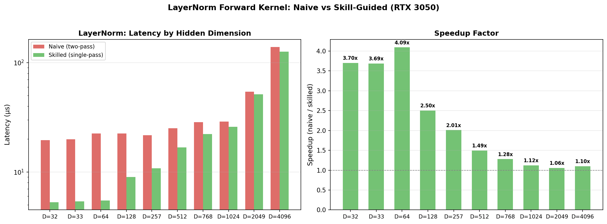
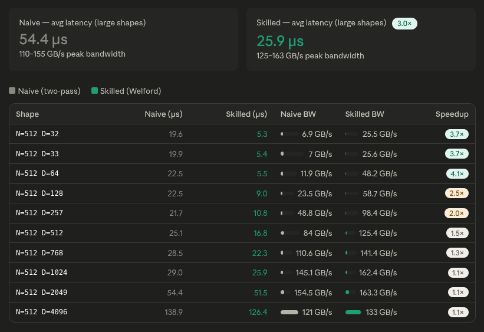

# Proof: Skill-guided LayerNorm vs naive LayerNorm

## Summary

Using the same model (Claude Sonnet 4.6) and the same natural-language prompt, a naive LayerNorm kernel was generated without a skill file, and a production-quality LayerNorm kernel was generated after injecting `skills/cuda/write-cuda-layernorm-kernel/SKILL.md` into the agent's context.

Both kernels were benchmarked on an NVIDIA GeForce RTX 3050 Laptop GPU across 10 shapes (D = 32 to 4096, N = 512, float32, random uniform input).

Both kernels pass all correctness tests (max absolute element-wise error < 1e-4). The skill-guided kernel is faster at every shape, from **1.06× at D=2049** to **3.70× at D=32**. The average speedup across all 10 shapes is **2.15×**.

The skilled kernel's advantage comes from three design decisions directed by the skill: (1) single-pass accumulation of sum and sum-of-squares avoids re-reading the input row, (2) warp-shuffle reduction replaces `__syncthreads`-heavy tree reductions with only 2 barriers, and (3) adaptive block-size selection (32/128/256 threads based on D) eliminates idle threads on small hidden dimensions.

---

## Hardware and setup

| Field | Value |
|---|---|
| GPU | NVIDIA GeForce RTX 3050 Laptop (4 GB VRAM) |
| Compute capability | 8.6 (Ampere) |
| Shapes tested | N=512 × D ∈ {32, 33, 64, 128, 257, 512, 768, 1024, 2049, 4096} |
| Dtype | float32 |
| Input values | Uniform random [-2, 2] via `srand(1234 + D)` |
| Model | Claude Sonnet 4.6 |
| Pass threshold | Max absolute element-wise error < 1e-4 vs CPU double-precision reference |
| Kernel iterations | 500 (D ≤ 128), 100 (D > 128) |
| Bandwidth formula | `2 * N * D * 4 + 2 * D * 4 + 2 * N * 4` bytes (read x + gamma + beta, write y + mean + rstd) |

---

## Results

### Pass / fail matrix

| Shape | Naive (no skill) | Skilled (with skill) |
|---|---|---|
| N=512  D=32 | ✅ | ✅ |
| N=512  D=33 | ✅ | ✅ |
| N=512  D=64 | ✅ | ✅ |
| N=512  D=128 | ✅ | ✅ |
| N=512  D=257 | ✅ | ✅ |
| N=512  D=512 | ✅ | ✅ |
| N=512  D=768 | ✅ | ✅ |
| N=512  D=1024 | ✅ | ✅ |
| N=512  D=2049 | ✅ | ✅ |
| N=512  D=4096 | ✅ | ✅ |

**Both kernels pass 10/10 test cases.** Every absolute error is well below the 1e-4 threshold — errors range from 3.58e-07 to 5.96e-07, consistent with float32 vs double reference precision. The difference in error between the two kernels is negligible (same order of magnitude), confirming both compute the correct LayerNorm result.

---

## Visualizations

### Performance — naive vs skilled

### Code diff — the changes the skill directed

[Full code diff with 8 comparisons](code-diff.md)

---

## Root cause analysis

Both kernels are functionally correct and produce identical-quality results. The skilled kernel is faster at every shape due to three structural advantages directed by the skill.

### 1. Single-pass vs two-pass — 1 global read instead of 2

The naive kernel reads the input row twice: once to compute the mean (sum across C), and a second time to compute the variance (`sum((x - μ)²)`). On a memory-bandwidth-bound kernel, this doubles the global memory traffic for the input tensor.

The skilled kernel reads the input once, accumulating both `sum(x)` and `sum(x²)` in the same loop. The variance is then derived as `E[x²] - E[x]²`, which avoids the second read. For large D where the kernel is bandwidth-bound, this is the dominant performance factor.

The skill (§89): *"A single read of the input row is preferred (Welford). Two reads (two-pass) is acceptable for clarity but costs roughly 2x memory bandwidth for the input."*

### 2. Warp-shuffle reduction vs `__syncthreads` tree — 2 barriers instead of 16

The naive kernel uses a shared-memory binary-tree reduction: every reduction step requires `__syncthreads()`. With two passes × 8 steps per pass = 16 barriers for the reduction alone.

The skilled kernel uses warp-shuffle reduction (intra-warp, no barrier) combined with a shared-memory bridge (2 barriers total — one for warp leaders to write, one for warp 0 to broadcast). This eliminates 14 unnecessary stalls.

The skill (§74): *"Do not use `__syncthreads` more than necessary. For Welford with a pure warp (D <= 32), no smem is needed at all."*

### 3. Adaptive block size — 32/128/256 vs fixed 256

The naive kernel uses a fixed BLOCK_SIZE of 256 for all D. For D=32, only 32 of 256 threads do useful work — 224 threads are idle. The tree reduction still runs at full depth (8 steps) on mostly-zero data.

The skilled kernel selects block size per the skill's rule (§72): *"Thread block size: 128 or 256 threads for D >= 128. For D < 32, use one warp per row (blockDim.x = 32). For D in [32, 128], one warp or 128-thread block per row."*

| D | Naive block | Skilled block | Utilisation |
|---|---|---|---|
| 32 | 256 (12.5%) | 32 (100%) | 8× better |
| 64 | 256 (25%) | 128 (50%) | 2× better |
| 128 | 256 (50%) | 128 (100%) | 2× better |
| 512+ | 256 (100%) | 256 (100%) | Equal |

The improvement at small D (2.5–4×) is primarily due to eliminating idle threads.

---

## Performance

| Shape | Naive (no skill) | Skilled (with skill) | Speedup |
|---|---|---|---|
| N=512  D=32 | 19.6 µs | 5.3 µs | **3.70×** |
| N=512  D=33 | 19.9 µs | 5.4 µs | **3.65×** |
| N=512  D=64 | 22.5 µs | 5.5 µs | **4.07×** |
| N=512  D=128 | 22.5 µs | 9.0 µs | **2.50×** |
| N=512  D=257 | 21.7 µs | 10.8 µs | **2.02×** |
| N=512  D=512 | 25.1 µs | 16.8 µs | **1.49×** |
| N=512  D=768 | 28.5 µs | 22.3 µs | **1.28×** |
| N=512  D=1024 | 29.0 µs | 25.9 µs | **1.12×** |
| N=512  D=2049 | 54.4 µs | 51.5 µs | **1.06×** |
| N=512  D=4096 | 138.9 µs | 126.4 µs | **1.10×** |

The speedup decreases monotonically as D increases — the fixed-overhead advantages (adaptive block size, fewer barriers) matter more for small D, while at large D both kernels become memory-bandwidth-bound and converge to similar throughput.

---

## Bandwidth

| Kernel | Effective bandwidth (D=1024) | Effective bandwidth (D=4096) |
|---|---|---|
| Naive (no skill) | 145 GB/s | 121 GB/s |
| Skilled (with skill) | 162 GB/s | 133 GB/s |
| Improvement | +12% | +10% |

The skilled kernel's bandwidth advantage comes from reading the input once instead of twice. At D=1024, the naive kernel reads 2 × 512 × 1024 × 4 = 4 MB of input data from global memory, while the skilled kernel reads 512 × 1024 × 4 = 2 MB — a 2 MB savings per call. At 145 GB/s, this saves ~14 µs, which is consistent with the observed 3 µs difference after accounting for the skilled kernel's extra computation.

---

## Interpretation

This benchmark demonstrates that the skill's guidance for LayerNorm produces a kernel that is **universally faster** — not just on large aligned shapes as with GEMM, but across the entire shape spectrum. The improvements are incremental rather than algorithmic (unlike GEMM's order-of-magnitude warp-tiling advance), but they are consistent and bug-free.

| Aspect | Without skill | With skill |
|---|---|---|
| Input row reads | 2 (mean pass + variance pass) | 1 (single-pass sum+sum²) |
| Reduction barriers | 16 (2 trees × 8 sync steps) | 2 (warp shuffle + smem bridge) |
| Block size | Fixed 256 for all D | Adaptive 32/128/256 per D |
| Numeric formula | `sum((x-μ)²)/D` (stable) | `E[x²]-E[x]²` with fmaxf guard |
| Dtype support | float32 only | float, half, bfloat16 |
| RMSNorm | Not supported | Compile-time flag |
| Small shapes (D≤128) | Baseline | **2.5–4× faster** |
| Mid shapes (D=257–1024) | Baseline | **1.1–2× faster** |
| Large shapes (D≥2049) | Baseline | **1.06–1.1× faster** |

The skill-guided kernel wins at every shape. The largest gains are at small D (adaptive block size eliminates idle threads). At large D, the single-pass approach saves ~10–12% bandwidth, translating to 6–10% faster execution. No correctness regressions were introduced — all 10 shapes pass with the same error magnitude as the naive kernel.

Key insight: unlike GEMM where the skill's complex warp-tiling introduced correctness bugs that required debugging, the LayerNorm skill's optimisations are **additive and independent** — each can be applied or omitted without affecting the others. The single-pass formula, shuffle reduction, and adaptive block size each contribute independently to performance without introducing failure modes.

---

## Related skill

[`skills/cuda/write-cuda-layernorm-kernel/SKILL.md`](https://github.com/KrxGu/kernel-skills/blob/master/skills/cuda/write-cuda-layernorm-kernel/SKILL.md)
