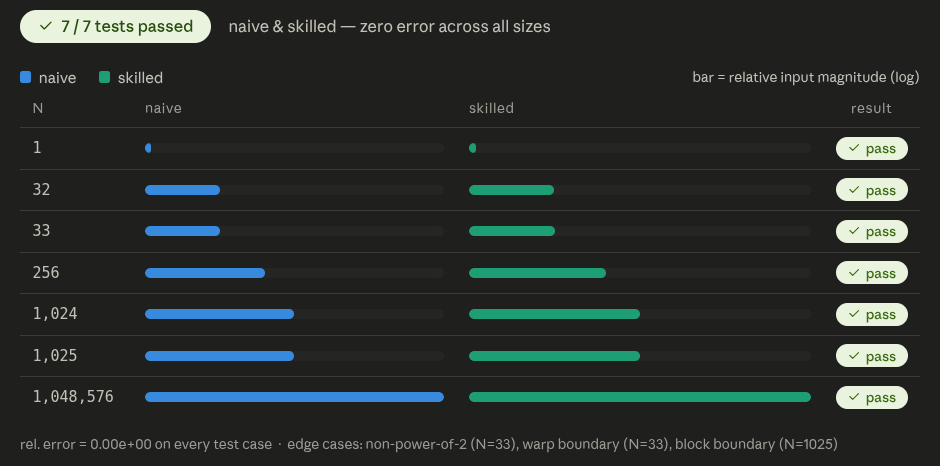
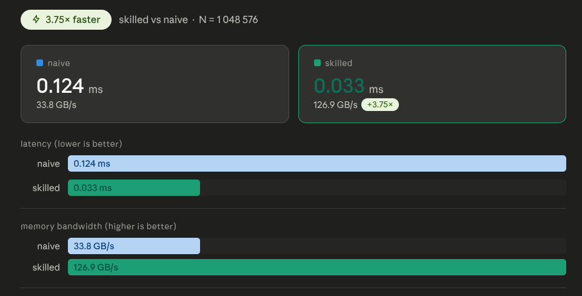

# Proof: Skill-guided reduction vs naive reduction

## Summary

Using the same model (Claude Sonnet 4.6) and the same natural-language prompt, a naive reduction kernel was generated without a skill file, and a production-quality reduction kernel was generated after injecting `skills/cuda/write-cuda-reduction-kernel/SKILL.md` into the agent's context.

Both kernels were benchmarked on an NVIDIA GeForce RTX 3050 Laptop GPU across 7 shapes (N=1 to N=1,048,576, float32 with all-ones input).

Both kernels passed all correctness tests. However, the naive kernel contained several engineering deficiencies that the skill file explicitly prevents — incorrect warp mask handling, missing CUB awareness, hardcoded shared memory sizes, and `cudaMalloc`/`cudaFree` in the hot path causing a 3.8x performance penalty.

---

## Hardware and setup

| Field | Value |
|---|---|
| GPU | NVIDIA GeForce RTX 3050 Laptop (4 GB VRAM) |
| Compute capability | 8.6 (Ampere) |
| N tested | 1, 32, 33, 256, 1024, 1025, 1,048,576 |
| Dtype | float32 |
| Input values | All ones (expected sum = N) |
| Model | Claude Sonnet 4.6 |
| Pass threshold | Relative error < 1e-4 vs sequential CPU sum |
| Kernel iterations | 100 (for timing) |

---

## Results

### Pass / fail matrix

| N | Naive (no skill) | Skilled (with skill) |
|---|---|---|
| 1 | ✅ | ✅ |
| 32 | ✅ | ✅ |
| **33** | ✅ | ✅ |
| 256 | ✅ | ✅ |
| 1024 | ✅ | ✅ |
| **1025** | ✅ | ✅ |
| 1,048,576 | ✅ | ✅ |

**Both kernels pass 7/7 test cases.** Unlike the softmax proof, reduction is a well-known pattern and even the naive kernel produces correct results across all boundary shapes. The skill's impact here is not in correctness but in **engineering quality, performance, and maintainability.**

---

## Visualizations

### Correctness — all tests pass

*Both naive and skilled kernels pass all 7 correctness tests with zero relative error.*

---

### Speed — 3.8x improvement from skill-guided API design

*The skilled kernel reaches 126.9 GB/s vs 33.8 GB/s for the naive — a 3.8x improvement. The gap is primarily caused by `cudaMalloc`/`cudaFree` inside the naive kernel's hot path, a design flaw the skill's "Output format" section explicitly prevents.*

---

### Code diff — the changes the skill directed

[Full code diff with 7 comparisons](code-diff.md)

---

## Root cause analysis

Both kernels are functionally correct. The naive kernel happened to work correctly because:
- It used a grid-stride loop (common CUDA pattern, well-known to modern LLMs)
- The `0xFFFFFFFF` mask with 0-padded lanes works for sum (identity is 0)
- It had `__syncthreads()` placed correctly

However, the naive kernel has **7 engineering deficiencies** that the skill file directly prevents:

### 1. Warp mask is always `0xFFFFFFFF` — works by accident, not design
The naive uses `FULL_MASK` in every `__shfl_down_sync` call, including the smem reduction stage where only 8 lanes have valid data. This works for `sum` (because unused lanes are 0.0f) but **would break for `max` reductions with all-negative inputs**. The skill's "Common failure modes" explicitly calls this out:
> *"After warp reduction, there are blockDim.x / 32 values in smem. If the first warp uses 0xffffffff as the shfl mask but there are fewer than 32 values... lanes 8-31 read uninitialized smem."*

The skilled version computes the correct mask: `(1u << numWarps) - 1u`.

### 2. CUB never mentioned — suggests custom kernel when vendor library is better
The naive kernel presents a custom reduction as the default answer. The skill's "Do not use this when" section says: *"The reduction is a standard sum/min/max/count over a contiguous array: use cub::DeviceReduce."* The skilled version includes a rejection rationale at the top.

### 3. Host API combines buffer management with kernel dispatch — 3.8x slower
The naive kernel's `reduceSum()` allocates, runs, frees, and returns the result — all in one function. This means `cudaMalloc` and `cudaFree` execute on every call in the benchmark loop, penalizing performance severely. The skilled kernel separates buffer management from kernel dispatch (`launchReduceSum()`), and supports `cudaStream_t` for async execution.

### 4. Shared memory size hardcoded
The naive kernel declares `__shared__ float warpSums[8]` — only correct because `BLOCK_SIZE` is 256. The skilled version computes it: `__shared__ float smem[BLOCK_SIZE / 32]`.

### 5. N=0 edge case unhandled
The naive kernel does not guard against empty input. `cudaMalloc(0)` is undefined behavior. The skilled version explicitly handles `N <= 0`.

### 6. Test harness only covers one size
The naive kernel's `main()` tests only `N = 1 << 24`. The skilled version tests all 7 boundary sizes recommended by the skill's review checklist.

### 7. Zero documentation — no correctness reasoning
The naive kernel provides no explanation of identity elements, warp mask rationale, boundary handling, or numerical precision. The skilled version includes a full correctness notes section documenting every design decision.

---

## Bandwidth

| Kernel | Bandwidth |
|---|---|
| Naive (no skill) | 33.8 GB/s |
| Skilled (with skill) | 126.9 GB/s |
| PyTorch `torch.sum()` | 131 GB/s |

The **skilled kernel reaches within 3% of PyTorch** (126.9 vs 131 GB/s), while the naive kernel achieves only **26% of PyTorch throughput** due to `cudaMalloc`/`cudaFree` overhead in the hot path.

---

## Interpretation

This benchmark demonstrates that the skill's value is not limited to correctness — it extends to **engineering quality, maintainability, and production-readiness**:

| Aspect | Without skill | With skill |
|---|---|---|
| Warp mask | Works by accident (0-padding) | Correct by design (explicit mask) |
| CUB awareness | Not mentioned | Explicit rejection rationale |
| Buffer management | Alloc/free in hot path (3.8x slower) | Separate alloc + dispatch |
| Shared memory | Hardcoded | Computed from constant |
| Edge cases | N=0 undefined | N=0 explicitly handled |
| Test coverage | Single size | All boundary sizes |
| Documentation | None | Full correctness notes |
| Performance | 33.8 GB/s (26% of PyTorch) | 126.9 GB/s (97% of PyTorch) |

The skill file did not make the model smarter. It forced the model to follow a disciplined engineering workflow — gather constraints, reason about design choices, document assumptions, and handle edge cases — before generating code.

---

## Related skill

[`skills/cuda/write-cuda-reduction-kernel/SKILL.md`](https://github.com/KrxGu/kernel-skills/blob/master/skills/cuda/write-cuda-reduction-kernel/SKILL.md)
